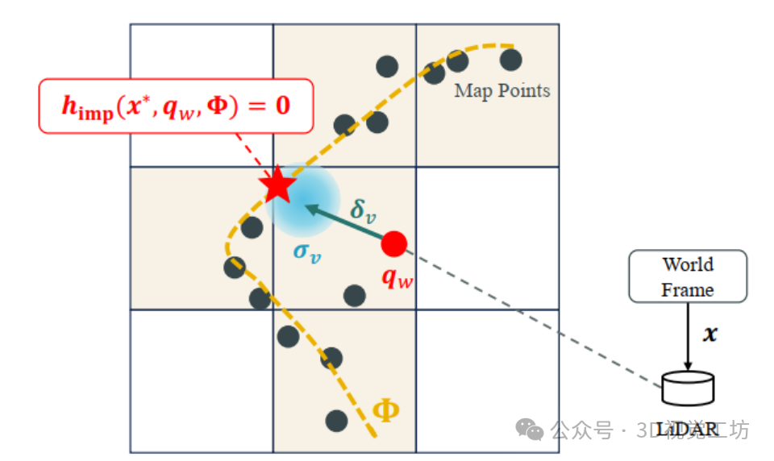
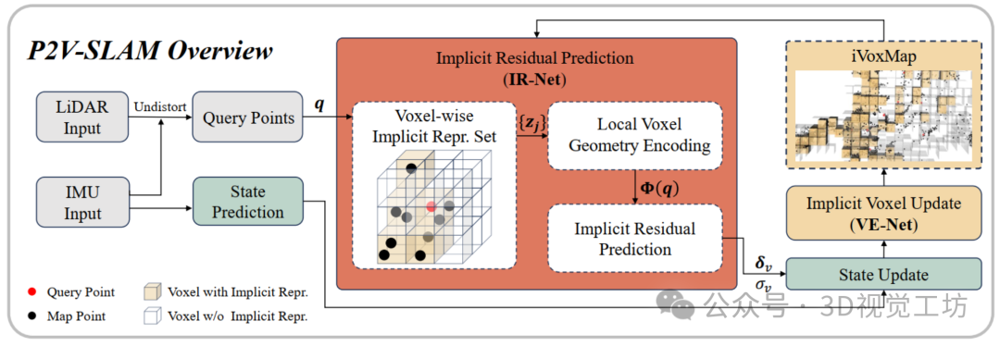
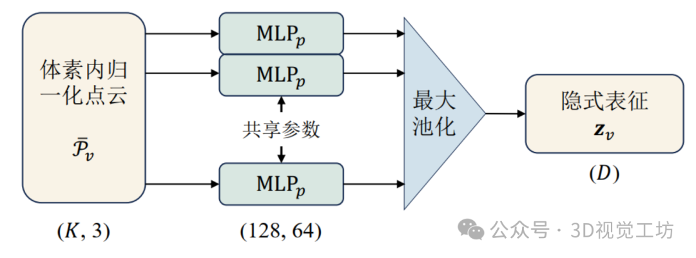
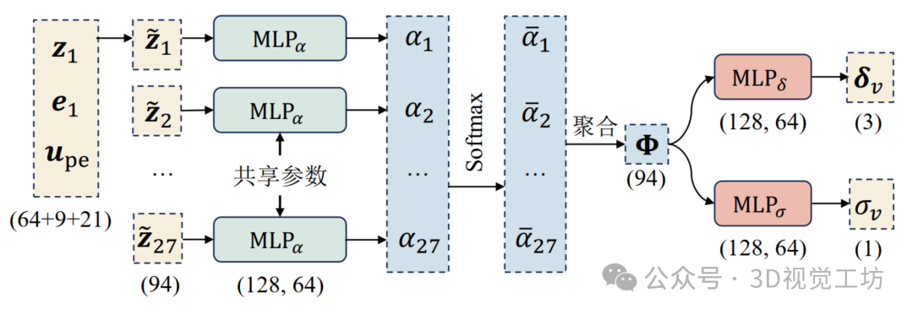
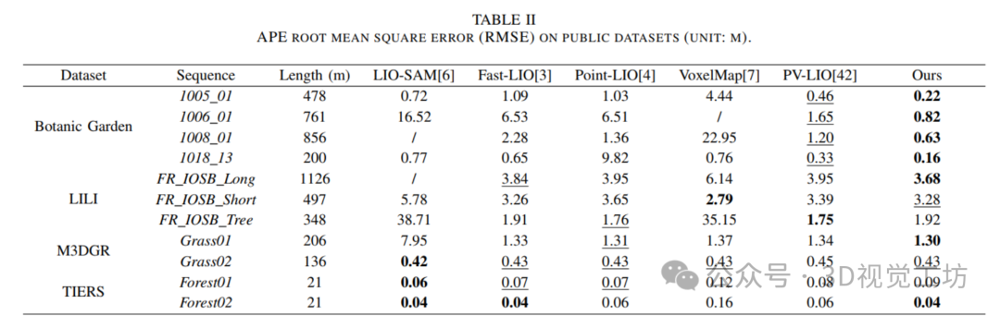
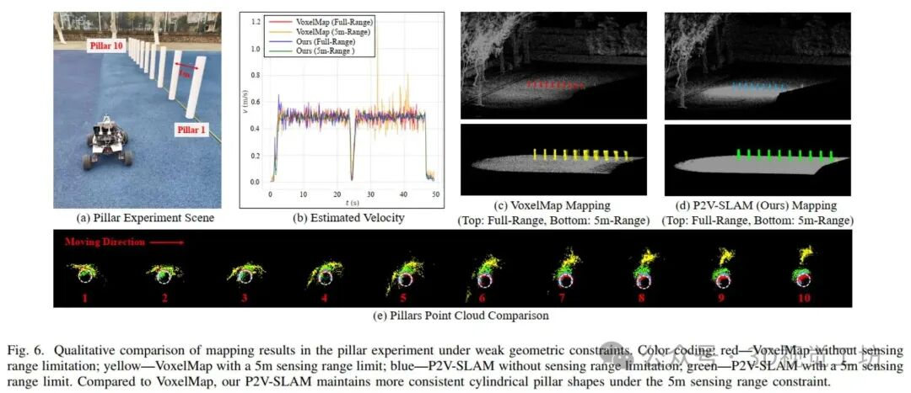
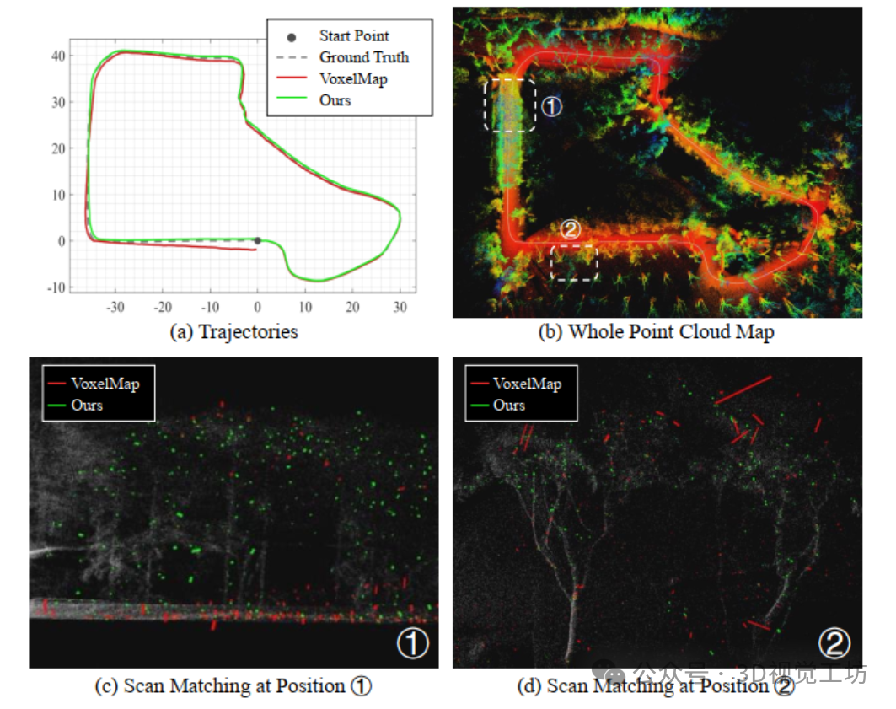
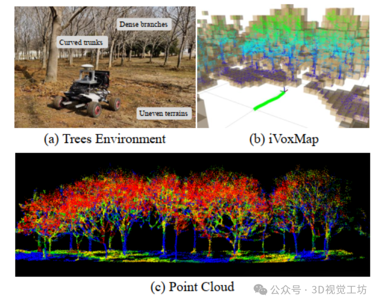
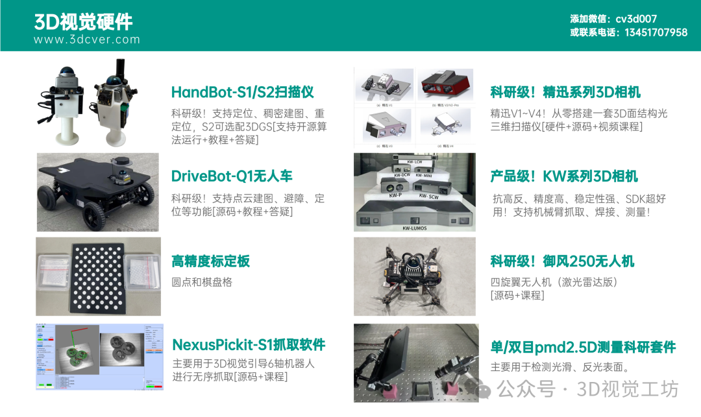

# 告别平面与直线 | 华中科技大学提出隐式点-体素SLAM，突破几何约束瓶颈！

> 公众号: 3D视觉工坊
> 发布时间: 2026-05-02 00:01
> 原文链接: https://mp.weixin.qq.com/s/PbNLeb-WCYkjoTYIQdpD7g

---

点击下方卡片，关注「3D视觉工坊」公众号
选择星标，干货第一时间送达

本文经作者授权发布 | 来源：3D视觉工坊

[「3D视觉从入门到精通」知识星球(点开有惊喜) ！](https://mp.weixin.qq.com/s?__biz=MzkyMTUwMTU5Mg==&mid=2247535546&idx=2&sn=c16963482a5c81515d4b606fbf606f8a&scene=21#wechat_redirect)星球内有20多门3D视觉系统课程、3DGS独家系列视频教程、顶会论文最新解读、海量3D视觉行业源码、项目承接、求职招聘等。想要入门3D视觉、做项目、搞科研，欢迎加入！

## 一、引言

从LOAM开始，LiDAR SLAM的观测模型主要采用“点-平面”或“点-直线”观测，用于构建残差，进而构建优化或滤波问题。然而，使用这种简单的模型存在问题：

- 许多场景并没有充足的平面，在这些场景中继续使用平面，会造成观测不足；
- 一些场景虽然有平面，但不是严格平面时，强行采用平面拟合，会引入观测误差。

为了避免平面/直线的约束，一些方法采用高斯分布进行表征（例如典型的NDT），或者用二次曲面，虽然这些方法在一定程度上降低了对平面的依赖，但依然是**参数化表征方法**，同样面临着表征能力不足、参数化表征存在误差的问题。那么，能否不预设任何几何形状，而让数据自己“学会”点到局部几何的关系呢？

为了解决上述问题，作者提出了Point-to-Voxel SLAM方法（P2V-SLAM），采用了一种**隐式**的观测模型：不用明晰的参数构建观测模型，而是用神经网络对体素进行表征。该方法推导了这种隐式观测下的状态更新，并集成到迭代误差状态Kalman滤波（IESKF）框架下，通过并行化等手段，实现了在CPU平台的实时运行。该论文已被SCI Q1期刊 IEEE Transactions on Automation Science and Engineering（T-ASE）发表，同时作者已经将全部 SLAM 代码和模型训练代码开源。

**论文出处**：`IEEE Transactions on Automation Science and Engineering（T-ASE） 2026`
**论文标题**：`Implicit Point-to-Voxel LiDAR-IMU SLAM`
**论文作者**：`Yan Dong; Enci Xu; Junyu Yang; Shaoqiang Qiu; Jiong Wang; Bin Han`
**论文网址**：`https://ieeexplore.ieee.org/document/11480788`
**作者单位**：华中科技大学
**论文代码**：`https://github.com/LarryDong/p2v-slam`

已关注Follow  Replay    Share     Like  Close**观看更多**更多

退出全屏切换到竖屏全屏退出全屏3D视觉工坊已关注Share Video，时长03:35

0/0

00:00/03:35 切换到横屏模式 继续播放进度条，百分之0[Play](javascript:;)00:00/03:3503:35[倍速](javascript:;)全屏 倍速播放中 [0.5倍](javascript:;)  [0.75倍](javascript:;)  [1.0倍](javascript:;)  [1.5倍](javascript:;)  [2.0倍](javascript:;)  [超清](javascript:;)  [流畅](javascript:;)  Your browser does not support video tags

继续观看

告别平面与直线 | 华中科技大学提出隐式点-体素SLAM，突破几何约束瓶颈！

观看更多转载,告别平面与直线 | 华中科技大学提出隐式点-体素SLAM，突破几何约束瓶颈！3D视觉工坊已关注Share点赞WowAdded to Top Stories[Enter comment](javascript:;)  [Video Details](javascript:;)

## 二、论文核心：隐式“点-体素”观测模型

隐式“点-体素”观测数学模型示意图

上图展示了二维隐式“点-体素”观测模型的原理。为隐式观测模型，其物理含义为：对于世界坐标系下的某个LiDAR 扫描点，在最优状态  下，应该位于局部的隐式表征  上。其中， 为局部隐式表征。

具体的，整个点云地图被划分为体素，每个体素具有一个**体素隐式表征**（Implicit Voxel Feature），一帧待配准的点云中每个点所在的体素作为中心体素，附近 个体素的隐式表征联合构建局部隐式几何表征 个体素的隐式表征联合构建局部隐式几何表征。隐式观测模型。隐式观测模型会根据扫描点和 会根据扫描点和，输出“点到体素”配准伪向量和不确定度。之后部分与经典的 IESKF 相同，优化最大后验问题：

式中，输出为隐式残差（）， 输出为隐式残差（Implicit Residual），为不确定度。二者均由神经网络进行实现。 为不确定度。二者均由神经网络进行实现。 隐式观测模型的线性化矩阵。

P2V-SLAM 的核心是，不再用任何参数化手段构建观测模型，但并不是完全用端到端方法，从而保证了能够集成到经典SLAM算法框架中且保证实时性。隐式观测采用神经网络进行实现。

## 三、关键模块

完整 P2V-SLAM 算法框架

P2V-SLAM 的整体流程如上图所示。其中有3个核心模块：隐式残差预测网络 IR-Net、隐式体素特征提取网络 VE-Net，以及隐式体素地图 iVoxMap。下面分开介绍。

### 1）隐式特征提取网络 VE-Net

该网络对每个体素内的地图点进行编码，得到一个体素级别的隐式表征。网络采用 PointNet 架构，对每个点采用一个 MLP 网络，之后通过池化得到表征。需要注意的是，与 PointNet 主要不同之处在于去除了 T-Net 这些旋转无关模块，因为SLAM中点云朝向是明确的，旋转不变性反而会破坏对位姿的敏感性。

VE-Net网络框架，将一个体素内几十个点压缩成一个固定长度的隐式向量

### 2）隐式残差预测网络 IR-Net

IR-Net 的作用是，根据 VE-Net 提取的隐式表征，和某个 LiDAR 扫描点，输出该点直线局部隐式几何的向量 \delta，和不确定度 \sigma。网络的结构图如下。网络将点坐标、邻域体素位置和体素特征三者融合，通过注意力机制得到局部几何的隐式表示，最后输出残差和不确定度。

IR-Net网络框架

该网络对每个扫描点进行傅里叶编码得到，对个体素相对位置进行得到，对27个体素相对位置进行 embedding 得到 e，再输入隐式特征，再输入隐式特征 z，得到联合向量，得到联合向量，通过注意力机制加权得到最终的局部几何隐式表征，通过注意力机制加权得到最终的局部几何隐式表征，再接输出的残差预测头，再接输出的残差预测头和不确定度预测头和不确定度预测头 。在树叶、杂波等区域，预测不可靠，网络会输出更大的。在树叶、杂波等区域，预测不可靠，网络会输出更大的，让优化框架自动降低该观测的权重。

### 3）隐式体素地图 iVoxMap

隐式体素地图以哈希表的方式管理每个体素，以及体素的更新。在SLAM运行过程中，每个配准到世界系的扫描点会直接加入到对应的体素，每个体素维持固定大小的点数，然后利用VE-Net提取隐式特征，并为每个扫描点提供中心体素坐标和邻域内的隐式特征。体素特征不是每帧更新，而是累积一定数量的点后再重新计算，以控制计算量。

## 四、网络训练

作者从真实世界采集了高精度数据集用于训练，并采用向量损失函数和负对数似然NLL损失函数，对VE-Net和IR-Net进行联合训练。损失函数如下：

其中，NLL损失函数相当于采用无监督的方式获得了不确定度：通过负对数似然损失，模型可以自适应地学习每个预测的不确定度，不需要额外标注。具体而言，如果一个体素过于杂乱，其隐式表征不能很好地预测残差时，模型会通过增加其不确定度的方式，降低该观测在训练中的权重。

## 五、实验结果

### 1）公开数据集实验

作者在 Botanic Garden、LILI、M3DGR、TIERS 四种公开数据集上测试，算法的定位精度整体超过主流SLAM算法。

公开数据集实验结果，方法取得领先

### 2）可控观测实验

为进一步证明，确实是所提出的“隐式观测”改善了 SLAM 性能，作者开展了观测可控场景的实验。作者在空旷的操场中摆放了10根圆柱形立柱，开展了如下对比试验：

- 不限制探测距离，SLAM定位过程中会利用较远处规则的几何区域（例如墙壁）；
- 限制探测距离，让LiDAR扫描范围内只有立柱，此时只有曲面；

在这两种设定下， 对比了经典的 VoxelMapping 算法（只利用平面）和所提出的 P2V-SLAM，作者发现：当不限制探测距离时，VoxelMapping 和 P2V-SLAM 取得了接近的定位和建图精度，然而当限制探测距离只有立柱曲面时，VoxelMapping 轨迹显著发散，而 P2V-SLAM 可以保持接近的定位精度。这直接反映出，VoxelMapping 只有在平面充足的情况下才能够获得较高的精度，而 P2V-SLAM 可以解决更加复杂的场景。

观测可控场景下的对比实验，所提出方法在有限观测下尽可能的保留了立柱的几何形状

### 3）其他结果直观展示

下图展示了Botanic Garden数据集某一序列上的对比结果，下方给出了基于平面的配准（红色线段）和 P2V-SLAM 提出的“点-体素”配准（绿色线段），可以看出，平面配准结果较为杂乱且集中在地面区域，而所提出方法在树冠、树叶区域具有更加一致性的配准，说明隐式模型更适应非平面结构。

匹配对比结果。所提出方法在杂乱区域的配准一致性更好

下图给出了作者在自己机器人上测试场景，图(b)为提出的 iVoxMap 地图管理，图(c)中对点云赋予了不同颜色，颜色通过隐式特征进行编码。可以看出，规则区域（树干、地面）的特征颜色主要为绿色/蓝色，非规则区域（树冠）主要为红色，这种颜色差异暗示隐式特征可能隐式地编码了物体的“规则性”信息，未来可用于语义建图。

真实场景实验结果

## 六、方法局限性

- 虽然算法在非结构化场景中取得了较高的定位与建图精度，但其使用了神经网络进行推理，计算量仍然较大。在 3.8GHz 8 线程 CPU 平台上，算法每 100ms 可处理约 1000–2000 个有效观测，其中绝大部分时间耗时在 IR‑Net 网络推理上。若场景较为复杂，为保证实时性，只能通过限制观测数量或减少迭代次数来缓解。实测表明，P2V‑SLAM 的耗时相比 Fast‑LIO2 慢约一个数量级，但仍能在 CPU 上实现实时运行。
- 网络对训练数据较为敏感。VE‑Net 和 IR‑Net 本质上是根据点云的局部分布预测合理的观测残差，若训练数据中某一类几何分布的占比较高，模型在其他分布上的泛化效果会相应下降。遗憾的是，作者未对此进行更深入的研究与分析。

## 七、总结与评价

这项工作的核心创新在于，采用隐式的“点-体素”观测模型，替代了传统方法中“点-面”、“点-线”、“二次曲面”或高斯分布等参数化建模方式，是一种典型的数据驱动方法。该设计避免了手工设计观测模型在复杂场景下适应性不足的问题，显著提升了泛化能力。同时，作者完整开源了SLAM代码、训练模型及训练流程，是一篇值得关注的高质量工作。

作者指出，尽管论文基于IESKF实现，但所提出的隐式观测模型可以无缝接入任意滤波或优化框架。此外，当前网络设计较为基础，未来通过轻量化改造（如网络剪枝、量化或更高效的特征融合）有望进一步提升运行效率。

需要强调的是，这项工作的最大价值并非又一次简单的精度提升，而是为 LiDAR SLAM 提供了一种全新的建模范式：从“假设体素几何”走向“学习体素几何”。尽管当前计算效率仍有提升空间，但其思路本身具有长远的研究价值，值得持续关注和深入探索。

本文仅做学术分享，如有侵权，请联系删文。

**[3D视觉方向论文辅导来啦！可辅导SCI期刊、CCF会议、本硕博毕设、核心期刊等](https://mp.weixin.qq.com/s?__biz=MzU1MjY4MTA1MQ==&mid=2247737977&idx=1&sn=849ad541524f0b4c0a659f0397556315&scene=21#wechat_redirect)。**

添加微信：cv3d001，备注：姓名+方向+单位，邀请入群。

